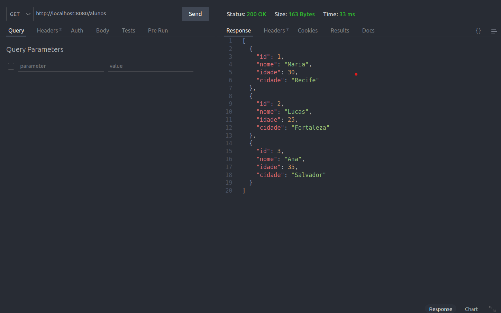

### Com o Dockerfile com as configurações necessárias,. Então podemos realizar o build e a execução.


#### `GET /health`
```sh
curl -X GET http://localhost:8080/health
```


#### `GET /alunos`
```sh
curl -X GET http://localhost:8080/alunos
```


#### `GET /aluno/:id`
```sh
curl -X GET http://localhost:8080/aluno/1
```


#### `POST /alunos`
```sh
curl -X POST http://localhost:8080/alunos -H "Content-Type: application/json" -d '{"nome":"Erik", "idade":27, "cidade":"Russas - CE"}'
```

